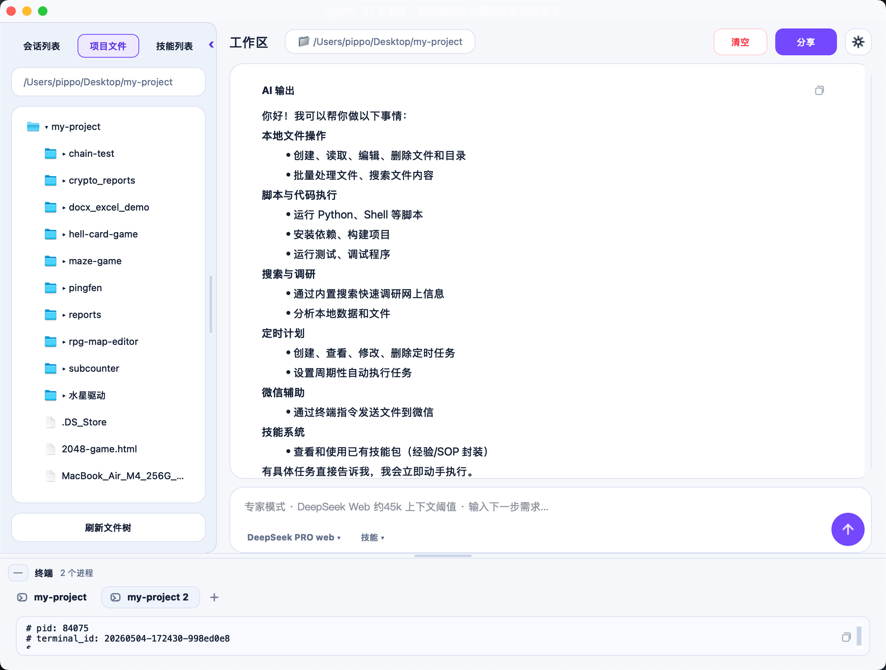
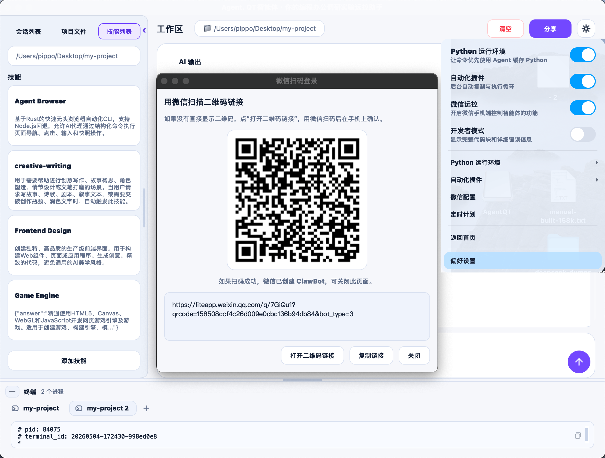

# AgentQT / Agent Qt

**AgentQT** (also written as **Agent Qt**) is a free local desktop coding agent with a Codex-like UI for web AI providers. The repository name is **free-coding-agent**.

Keywords: AgentQT, Agent Qt, free-coding-agent, coding agent, AI coding agent, Codex UI, desktop agent, PySide6, Python, web AI provider, local automation.


一个本地桌面智能体：把大模型的 Markdown 输出变成本地可执行的工程动作，支持自动写文件、执行命令、展示 diff、管理后台终端、沉淀技能，并通过微信和定时计划把工作流延伸到桌面之外。

最早的形态是“复制提示词、粘贴 AI 回复、本地安全执行”。现在它更接近一个国内模型可用的 Codex 桌面壳：能用网页 Provider 自动循环执行，也能保留手动复制粘贴模式；能在工作区里维护技能、会话、终端、文件变更和定时计划；还能通过微信发送自然语言让电脑继续干活。

> 当前版本仍以个人工作站为中心：它会真实写入文件、启动进程、调用网页模型和本地服务。请只在你理解风险的工作区里使用。

## 截图

### 首页


### 工作区与文件变更


### 项目文件与会话



### 技能、微信与设置



## 核心功能

- 自动化执行：网页 Provider 生成回复后，Agent Qt 自动解析命令块、写入文件、执行命令，并把结果继续喂回下一轮。
- 手动协议：保留“复制系统提示词 + 粘贴 AI 回复”的低依赖模式，适合任何支持 Markdown 的模型网页。
- 文件写入协议：命令块里使用带编号占位符，大段源码放在后续 fenced code block，减少 heredoc 写坏和上下文污染。
- 终端管理：开发服务器、构建、安装、长耗时命令会进入底部终端，可查看控制台输出、停止进程、让模型按 PID 回查日志。
- 文件变更：执行后展示变更文件、增删行数、diff、内部 git 快照，并支持状态校验后的 Undo / Redo。
- 多会话：同一个工作区可以维护多个会话，每个会话有独立历史、执行记录和 diff 缓存。
- 技能系统：工作区可保存 `SKILL.md`，在自动化输入时手动选择，让模型按固定流程、模板和偏好工作。
- 微信远控：扫码登录后，可以在微信里发送自然语言需求、停止当前输出、列出会话、切换会话、查看文件树。
- 定时计划：可以创建每日 schedule，让 Agent Qt 到点触发自动化工作流，例如每天整理进度、检查项目状态或生成汇报草稿。
- 偏好与诊断：提供主题、字号、Python 运行环境、自动化插件、微信配置、日志和 Provider 状态入口。

## 快速开始

### macOS / Linux

```bash
python3 -m venv .venv
source .venv/bin/activate
pip install PySide6
python agent_qt.py
```

### Windows

```powershell
py -m venv .venv
.venv\Scripts\activate
pip install PySide6
python agent_qt.py
```

## 推荐工作流

1. 启动应用，选择现有项目工作区。
2. 开启“自动化插件”，登录网页 Provider。
3. 在底部自动化输入框里直接描述目标，例如“把下拉框改成适合平板打分的按钮组”。
4. Agent Qt 会循环请求模型、执行命令、观察结果，直到模型回复完成标记或达到最大轮数。
5. 查看执行日志、文件变更卡片和 diff；需要时点击 Undo / Redo。
6. 对固定流程，可以保存 Skill；对周期性工作，可以创建“定时计划”；离开电脑时，也可以用微信继续发消息。

仍然可以使用旧的手动模式：复制系统提示词到任意 AI 网页，再把完整回复粘贴回 Agent Qt 执行。

## AI 输出协议

Agent Qt 推荐让 AI 把所有命令放在一个 Bash 代码块里，大段文件内容用占位符替代，并在后面给出对应代码块：

```bash
cd /your/project/path
cat > index.html << 'EOF'
<!-- HTML block -->
EOF

cat > style.css << 'EOF'
<!-- CSS block -->
EOF

python3 -m http.server 9999
```

```html
<!doctype html>
<html>
  <head>
    <link rel="stylesheet" href="style.css">
  </head>
  <body>Hello Agent</body>
</html>
```

```css
body {
  font-family: system-ui, sans-serif;
}
```

程序会先缓存后续代码块，再执行 Bash，并把 `<!-- HTML block -->`、`<!-- CSS block -->` 替换成对应内容。重复占位符会按出现顺序依次匹配，适合一次写入多个 SVG、JSON 或其他同类型文件。

## 缓存与隐私

每个工作区会生成一个隐藏目录：

```text
.agent_qt/
├── schedules.json
├── skills/
│   └── <skill-id>/SKILL.md
└── threads/
    └── <thread-id>/
        └── history.json
```

这里保存会话历史、技能、定时计划、执行日志索引和 diff 记录。点击“清空记录”只会清空当前会话卡的缓存，不会删除其他会话，也不会删除项目文件。

## Provider 维护

如果 DeepSeek 网页后续改版，仓库里已经保留了网页 Provider 的回归资产和升级提示词。优先参考：

- [docs/deepseek-web-upgrade-prompt.md](docs/deepseek-web-upgrade-prompt.md)
- `scripts/run_deepseek_copy_validation.py`
- `tests/fixtures/deepseek-copy-validation/web-cases-100.json`

## 安全说明

Agent Qt 会真实写入文件并执行本地命令。请只执行你理解并信任的 AI 输出。尤其注意：

- 不要执行包含删除、格式化、上传密钥、修改系统配置的可疑命令。
- 执行前可以先阅读 AI 回复区中的 Bash 块。
- Undo / Redo 是基于文件快照的保护机制，但它不是完整版本控制系统。
- 建议重要项目同时使用 Git。
- 微信远控和定时计划会扩大触发面。开启前请确认当前工作区、Provider、自动化插件和本机网络环境是你信任的。
- 定时计划目前依赖桌面应用持续运行。应用退出、电脑睡眠或系统崩溃时，不保证补跑错过的计划。

## 打包

可以使用 PyInstaller 打包为单文件应用：

```bash
pip install pyinstaller
pyinstaller --onefile --windowed agent_qt.py
```

Qt 运行时体积较大，单文件可执行文件通常不会很小，这是桌面 GUI 程序的正常情况。

## 项目结构

```text
.
├── agent_qt.py
├── README.md
└── docs/
    └── images/
        ├── agent-qt-home.png
        ├── agent-qt-workspace.png
        ├── agent-qt-files.png
        ├── agent-qt-skills.png
        └── agent-qt-diff.png
```

## 后续计划

- [Agent 机制设计笔记](docs/agent-design.md)：记录占位符协议、自动化循环、终端观察、微信远控、定时计划和后续加固点。
- Schedule 队列：多个计划、多个会话、用户即时提问同时到来时，需要统一排队、抢占、暂停和恢复策略。
- 守护进程：桌面应用关闭、崩溃、系统重启后，后续可以用轻量 daemon 负责拉起和补偿错过的 schedule。
- Web research：优先复用 Provider 网页搜索能力；后续再考虑独立搜索接口、引用管理和多轮 research 计划器。
- Browser automation：基于 Playwright 做网页观察和自动化操作；视觉级 computer use 可作为更后面的独立模块。
- 更细的权限控制：执行前标记高风险命令，并把微信/定时计划触发的动作纳入权限边界。

## License

本项目采用 MIT License 开源，详见 [LICENSE](LICENSE)。
