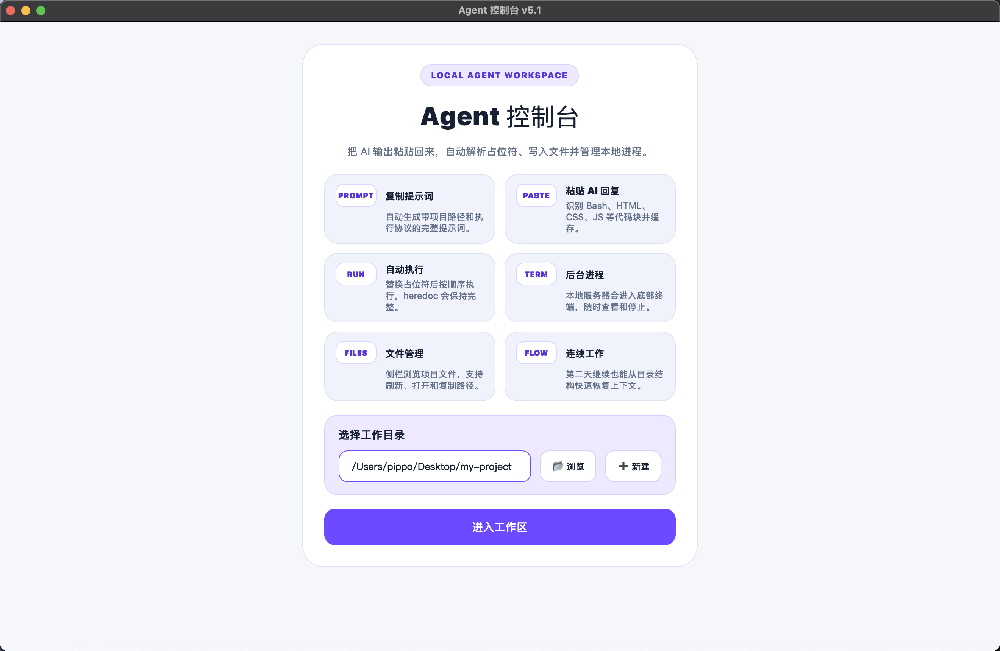
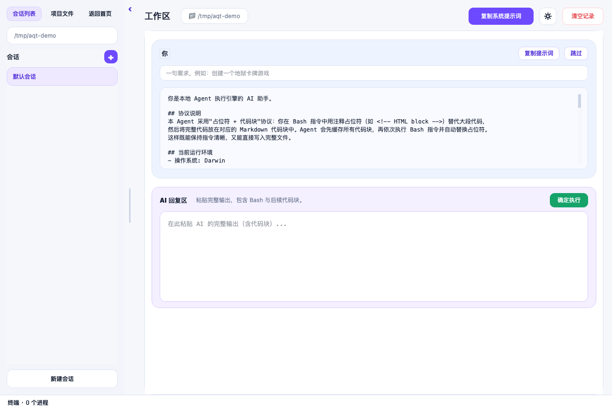
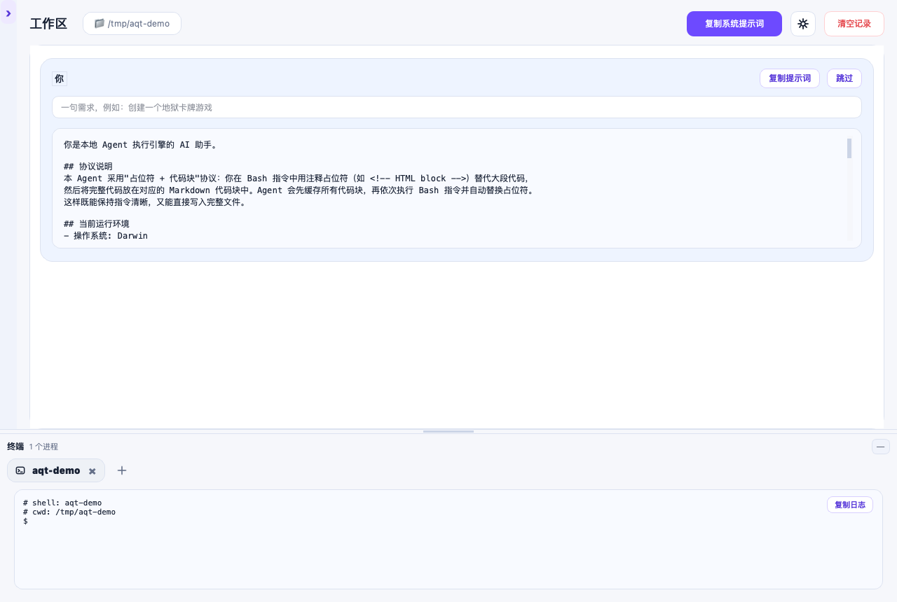
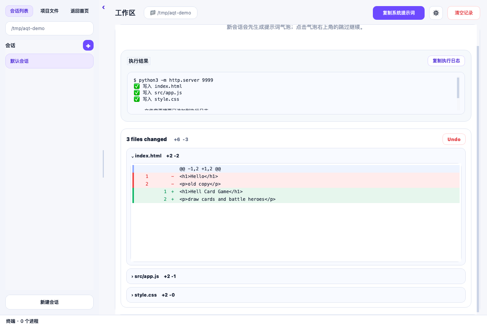

# Agent 控制台

一个单文件 PySide6 桌面应用：把 AI 的代码生成结果复制回来，本地自动解析、写入文件、执行命令、展示 diff，并管理长期运行的终端进程。

它适合这样一种工作流：你在任意 AI 聊天窗口里让模型生成项目或修改代码，然后把完整回复粘贴到 Agent 控制台。应用会按照约定协议把占位符替换成真实代码块，顺序执行 Bash 指令，并把文件变更、日志和本地服务集中展示出来。

> 当前版本偏向“人工复制粘贴 + 本地安全执行”。项目只提供一套本地执行协议和示例工作流，供学习、研究与个人实践参考。

## 截图

### 首页



### 工作区与会话



### 底部终端



### 文件变更与 Diff



## 核心功能

- 复制系统提示词：自动注入当前工作区路径、操作系统、Shell、路径风格和执行协议。
- 粘贴 AI 回复：支持 Bash、HTML、CSS、JS、Python、SVG、JSON、YAML 等 Markdown 代码块。
- 占位符协议：在 Bash 中使用 `<!-- HTML block -->` 等占位符，大段文件内容放在后续代码块中，程序会按顺序替换。
- 自动执行命令：支持 `cd`、heredoc、多行命令、文件写入和常见本地启动命令。
- 后台终端：长期运行的服务会进入底部终端面板，可切换、复制日志、关闭进程。
- 多会话：同一个工作区下可以创建多个会话卡，每个会话拥有自己的历史记录和 diff 缓存。
- 文件侧栏：浏览项目文件，展开/折叠目录，右键打开文件、打开目录、复制路径。
- 变更卡片：执行后展示 `files changed`、增删行数和可展开 diff。
- Undo / Redo：基于完整文件内容校验，只有当前文件状态与记录匹配时才允许回滚或重做。
- 本地缓存：历史记录保存在工作区隐藏目录 `.agent_qt/` 中，方便关闭后继续查看。

## 快速开始

### macOS / Linux

```bash
python3 -m venv .venv
source .venv/bin/activate
pip install PySide6
python agent_qt.py
```

### Windows

```powershell
py -m venv .venv
.venv\Scripts\activate
pip install PySide6
python agent_qt.py
```

## 推荐工作流

1. 启动应用，选择你的项目工作区。
2. 点击“复制系统提示词”，在气泡里补一句需求，例如“创建一个地狱卡牌游戏”。
3. 把提示词粘贴到你正在使用的 AI 聊天工具中。
4. 将 AI 的完整回复粘贴回“AI 回复区”。
5. 点击“确定执行”，等待本地命令执行完成。
6. 查看执行日志、文件变更卡片和 diff；需要时点击 Undo / Redo。

## AI 输出协议

Agent 控制台推荐让 AI 把所有命令放在一个 Bash 代码块里，大段文件内容用占位符替代，并在后面给出对应代码块：

```bash
cd /your/project/path
cat > index.html << 'EOF'
<!-- HTML block -->
EOF

cat > style.css << 'EOF'
<!-- CSS block -->
EOF

python3 -m http.server 9999
```

```html
<!doctype html>
<html>
  <head>
    <link rel="stylesheet" href="style.css">
  </head>
  <body>Hello Agent</body>
</html>
```

```css
body {
  font-family: system-ui, sans-serif;
}
```

程序会先缓存后续代码块，再执行 Bash，并把 `<!-- HTML block -->`、`<!-- CSS block -->` 替换成对应内容。重复占位符会按出现顺序依次匹配，适合一次写入多个 SVG、JSON 或其他同类型文件。

## 缓存与隐私

每个工作区会生成一个隐藏目录：

```text
.agent_qt/
└── threads/
    └── <thread-id>/
        └── history.json
```

这里保存当前会话的提示词、AI 输出、执行日志和 diff 记录。点击“清空记录”只会清空当前会话卡的缓存，不会删除其他会话，也不会删除项目文件。

## 安全说明

Agent 控制台会真实写入文件并执行本地命令。请只执行你理解并信任的 AI 输出。尤其注意：

- 不要执行包含删除、格式化、上传密钥、修改系统配置的可疑命令。
- 执行前可以先阅读 AI 回复区中的 Bash 块。
- Undo / Redo 是基于文件快照的保护机制，但它不是完整版本控制系统。
- 建议重要项目同时使用 Git。

## 打包

可以使用 PyInstaller 打包为单文件应用：

```bash
pip install pyinstaller
pyinstaller --onefile --windowed agent_qt.py
```

Qt 运行时体积较大，单文件可执行文件通常不会很小，这是桌面 GUI 程序的正常情况。

## 项目结构

```text
.
├── agent_qt.py
├── README.md
└── docs/
    └── images/
        ├── agent-qt-home.png
        ├── agent-qt-workspace.png
        ├── agent-qt-terminal.png
        └── agent-qt-diff.png
```

## 后续计划

- [Agent 机制设计笔记](docs/agent-design.md)：记录占位符协议、自动化循环、文件变更摘要、后台终端 registry/log、上下文压缩和后续加固点。
- 设置面板：字号、主题、语言等偏好。
- 协议扩展：继续完善提示词协议、执行日志格式和本地权限提示。
- 更细的权限控制：执行前标记高风险命令。
- 更完整的跨平台打包：macOS、Windows、Linux 分别提供构建脚本。

## License

本项目采用 MIT License 开源，详见 [LICENSE](LICENSE)。
